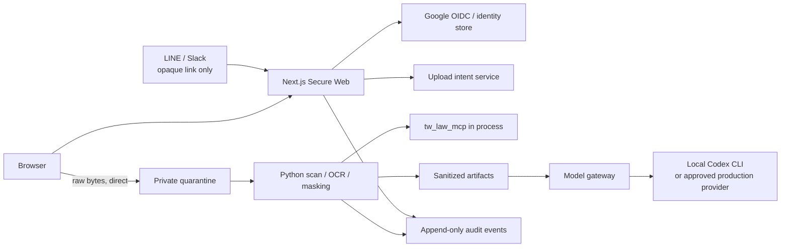

# Secure Web architecture

## Requirements

| ID | Requirement | Component | Verification |
| --- | --- | --- | --- |
| R1 | Secure browser application for one pilot user and up to 20 concurrent users | Next.js web/BFF | Browser and build acceptance |
| R2 | LINE/Slack entry with Google human identity | Channel adapters + Better Auth Google provider | Callback, state, nonce, replay tests |
| R3 | Canonical user and case authorization | Identity store + authorization DAL | Cross-user/case negative tests |
| R4 | Raw data bypasses web/model/logs | Upload intent + direct storage port | Canary leak test |
| R5 | Quarantine before downstream access | Upload state machine + scanner/masking worker | State-transition tests |
| R6 | Taiwan domain logic remains deterministic | Python worker importing `tw_law_mcp` | Python integration test |
| R7 | Model receives masked minimum only | Model gateway + Codex CLI local provider | Payload and command-policy tests |
| R8 | Case/HITL/evidence workflow | Secure app routes and services | Workflow/browser tests |
| R9 | Audit, retention, and verified deletion | Audit and deletion services | Deletion acceptance |
| R10 | Production configuration fails closed | Runtime config validator | Production-negative tests |
| R11 | Accessible architectural editorial UI | Design tokens and accessible components | WCAG/keyboard/mobile checks |
| R12 | Deployment path to GCP Taiwan region | Cloud Run/SQL/GCS/Tasks manifests | Config and container acceptance |

## Runtime topology

## Trust boundaries

1. **Channel boundary:** messages contain opaque case/action links and status only.
2. **Web boundary:** the BFF authenticates, authorizes, and issues capabilities; it does
   not receive raw file request bodies.
3. **Quarantine boundary:** objects are private and unreadable downstream until scan,
   validation, masking, and clean promotion succeed.
4. **Domain boundary:** the worker calls `tw_law_mcp` in process using masked text and
   metadata; law decisions are not duplicated in TypeScript.
5. **Model boundary:** only allowlisted sanitized fields cross this boundary. Local
   Codex execution is read-only, ephemeral, and isolated from the repository.
6. **Single-user host boundary:** Google authenticates the owner, the reverse proxy
   terminates HTTPS, private SQLite/files remain on encrypted host storage, and the
   Codex worker stays bound to loopback.
7. **Cloud production boundary:** production refuses local filesystem, local auth,
   local DB, in-process jobs, and Codex CLI provider.

## State machines

### Upload

`pending -> uploading -> uploaded -> scanning -> rejected | clean -> masking -> sanitized -> deleted`

No transition may skip `scanning` or `masking`. `rejected` and `deleted` are terminal.

### Case

`draft -> awaiting_upload -> processing -> awaiting_review -> completed | failed -> deleted`

Every transition records actor, case, timestamp, previous state, next state, and a
content-free reason code.

### Channel identity

`issued -> authenticated -> linked -> unlinked`

Link token and nonce are single-use. Re-linking an already linked channel identity
requires explicit unlink or an administrator-reviewed recovery flow.

## Data classes

| Class | Examples | Allowed storage | Model allowed |
| --- | --- | --- | --- |
| Raw restricted | drawings, letters, addresses, title blocks | Quarantine only | No |
| Sanitized confidential | masked OCR, atomic correction items | Sanitized store | Minimum necessary fields only |
| Derived audit | gate status, source IDs, workflow state | Database/audit | No raw spans |
| Public/reference | law corpus, source policies | `tw_law_mcp` data | Yes when needed |

## Orphan check

- Every R1-R12 requirement maps to at least one component and verification path.
- Every runtime component above serves at least one R1-R12 requirement.
- FastMCP is intentionally excluded because no remote tool consumer exists yet.
