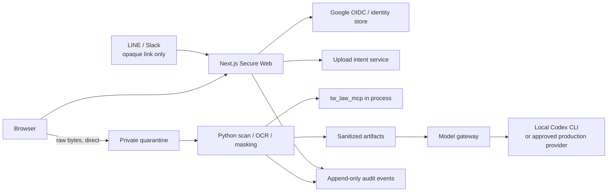

# Secure Web architecture

The current target is local or single-user. `reviewer` memberships and
`invitation` records are reserved schema only; there is no supported case-level
invitation or reviewer onboarding flow yet.

## Requirements

| ID | Requirement | Component | Verification |
| --- | --- | --- | --- |
| R1 | Secure browser application for one pilot user and up to 20 concurrent users | Next.js web/BFF | Browser and build acceptance |
| R2 | LINE/Slack entry with Google human identity | Channel adapters + Better Auth Google provider | Callback, state, nonce, replay tests |
| R3 | Canonical user and case authorization | Identity store + authorization DAL | Cross-user/case negative tests |
| R4 | Raw data bypasses web/model/logs | Upload intent + direct storage port | Canary leak test |
| R5 | Quarantine before downstream access | Upload state machine + scanner/masking worker | State-transition tests |
| R6 | Taiwan domain logic remains deterministic | Python worker importing `tw_law_mcp` | Python integration test |
| R7 | Model receives masked minimum only | Model gateway + Codex CLI local provider | Payload and command-policy tests |
| R8 | Case/HITL/evidence workflow | Secure app routes and services | Workflow/browser tests |
| R9 | Audit, retention, and verified deletion | Audit and deletion services | Deletion acceptance |
| R10 | Production configuration fails closed | Runtime config validator | Production-negative tests |
| R11 | Accessible architectural editorial UI | Design tokens and accessible components | WCAG/keyboard/mobile checks |
| R12 | Deployment path to GCP Taiwan region | Cloud Run/SQL/GCS/Tasks manifests | Config and container acceptance |

## Runtime topology

```mermaid
flowchart LR
    Channel["LINE / Slack\nopaque link only"] --> Web["Next.js Secure Web"]
    Browser["Browser"] --> Web
    Web --> Identity["Google OIDC / identity store"]
    Web --> Intent["Upload intent service"]
    Browser -->|"raw bytes, direct"| Quarantine["Private quarantine"]
    Quarantine --> Worker["Python scan / OCR / masking"]
    Worker --> Domain["tw_law_mcp in process"]
    Worker --> Sanitized["Sanitized artifacts"]
    Sanitized --> Model["Model gateway"]
    Model --> Codex["Local Codex CLI\nor approved production provider"]
    Web --> Audit["Append-only audit events"]
    Worker --> Audit
```

## Trust boundaries

1. **Channel boundary:** messages contain opaque case/action links and status only.
2. **Web boundary:** the BFF authenticates, authorizes, and issues capabilities; it does
   not receive raw file request bodies.
3. **Quarantine boundary:** objects are private and unreadable downstream until scan,
   validation, masking, and clean promotion succeed.
4. **Domain boundary:** the worker calls `tw_law_mcp` in process using masked text and
   metadata; law decisions are not duplicated in TypeScript.
5. **Model boundary:** only allowlisted sanitized fields cross this boundary. Local
   Codex execution is read-only, ephemeral, and isolated from the repository.
6. **Single-user host boundary:** Google authenticates the owner, the reverse proxy
   terminates HTTPS, private SQLite/files remain on encrypted host storage, and the
   Codex worker stays bound to loopback.
7. **Cloud production boundary:** production refuses local filesystem, local auth,
   local DB, in-process jobs, and Codex CLI provider.
8. **Provenance boundary:** run identity, artifact digests, and human approvals are
   minted by the server. Callers may return artifacts but cannot author audit
   evidence; see "Audit provenance" below.

## Authorization revocation

The owner allowlist is evaluated on every protected entry point, not only when an
account is created. `isIdentityAllowed` is the single policy, and it is consulted from
three places: the user-creation hook, the session-creation hook, and `getAppSession`.
Changing `OWNER_EMAIL` or deactivating an invitation therefore takes effect for
accounts and sessions that already exist — an identity that no longer passes has all of
its sessions deleted on its next request, not just the one it presented.

## Audit provenance

Compliance evidence is only worth something if the caller cannot write it.

- `run_tw_corrections_analysis` mints an unguessable `run_id`, embeds it with the input
  digest in `run_meta.json`, and records the digest of every artifact it produced.
- `run_tw_corrections_response` re-digests the artifacts it is handed. A mismatch is
  reported as `artifacts_modified`, an unrecognized run as `unknown_run`; neither can be
  upgraded by anything the caller sends.
- Caller-supplied confirmation fields (`confirmed_by_human`, `human_review_status`,
  `human_review_answer`, and a `人工確認完成` adjudication) are stripped before the
  server recomputes its own verdict, and listed in `ignored_caller_asserted_fields`.
- A HITL answer counts as a confirmation only when `record_hitl_approval` bound it to a
  run, an artifact digest, and an authenticated human. Otherwise the evidence record
  reads `unapproved` and `human_review_required` stays true.
- An approval covers the *decision* that was approved, not the question key in general.
  The submitted answer is re-digested and compared against `ApprovalRecord.answer_digest`,
  so an answer edited after approval — a retry, another integration writing the same key —
  stops counting as approved.
- A run that asked no questions reports `no_confirmation_required` rather than
  `unapproved`. Flagging every such run would drain the signal from
  `human_review_required`, and the worker auto-completes exactly these runs. The path is
  only reachable when `provenance_status` is `server_verified`, so stripping the question
  set out of tampered artifacts cannot buy it.
- Approval recording is deliberately not an MCP tool: an MCP client is the agent, so
  letting it record its own approval would only launder an assertion into evidence. The
  secure worker calls it with the session user who actually answered.

## Law corpus verification

An article is in the corpus for one of two reasons, and the difference is load-bearing.

| `verification_status` | Meaning | `text` | Citation gate |
| --- | --- | --- | --- |
| `snapshot_verified` | Text was snapshotted from the official source and checksummed | present | can pass |
| `pending_snapshot` | A source pack references the article, but nobody has verified its text | must be absent | **always fails** |

A `pending_snapshot` article is a lead, not a citation. `verify_citation` reports
`exists: false` for it, `_infer_correction_article` yields
`citation_status: "pending_source_verification"`, and the item keeps
`human_review_required`. What the reviewer gains over an unresolved item is the
candidate law and its source URL, instead of "找不到可比對的法源條文".

`run_source_coverage_acceptance` keeps the corpus and the source packs honest with each
other: every article a pack references must exist, every article must have a source
policy, and a `pending_snapshot` article carrying text is a failure — that would be an
unverified snapshot wearing a verified one's clothes. The packs advertised 消防法 and
建築技術規則 articles the corpus never held, which is why every fire or compartment
correction resolved to nothing; this gate makes that class of drift fail loudly.

Source policies distinguish the same two things at their own level:
`source_policy_evidence_complete` asks whether a policy declares its evidence fields (a
pending source does, via `pending_reason`), while `all_sources_verified` and
`pending_sources` report what has actually been verified. Completeness of the
declaration is not verification, and the acceptance output states both.

## Worker backpressure

The worker refuses work it cannot finish rather than growing threads, memory, and Codex
subprocesses without a ceiling. Connections are capped by
`WORKER_MAX_INFLIGHT_REQUESTS`, background analysis runs in a bounded pool
(`WORKER_MAX_PROCESSING_WORKERS`, `WORKER_MAX_PENDING_JOBS`), and capacity is reserved
*before* an upload body is read, so an overloaded worker never writes a quarantine file
it cannot analyze. Over capacity it answers `503` with `Retry-After`. Connections are
bounded by `WORKER_REQUEST_TIMEOUT_SECONDS` and the model subprocess by
`WORKER_MODEL_TIMEOUT_SECONDS`; a timed-out provider is killed by process group so no
grandchild survives it.

## State machines

### Upload

`pending -> uploading -> uploaded -> scanning -> rejected | clean -> masking -> sanitized -> deleted`

No transition may skip `scanning` or `masking`. `rejected` and `deleted` are terminal.

### Case

`draft -> awaiting_upload -> processing -> awaiting_review -> completed | failed -> deleted`

Every transition records actor, case, timestamp, previous state, next state, and a
content-free reason code.

### Channel identity

`issued -> authenticated -> linked -> unlinked`

Link token and nonce are single-use. Re-linking an already linked channel identity
requires explicit unlink or an administrator-reviewed recovery flow.

## Data classes

| Class | Examples | Allowed storage | Model allowed |
| --- | --- | --- | --- |
| Raw restricted | drawings, letters, addresses, title blocks | Quarantine only | No |
| Sanitized confidential | masked OCR, atomic correction items | Sanitized store | Minimum necessary fields only |
| Derived audit | gate status, source IDs, workflow state | Database/audit | No raw spans |
| Public/reference | law corpus, source policies | `tw_law_mcp` data | Yes when needed |

## Orphan check

- Every R1-R12 requirement maps to at least one component and verification path.
- Every runtime component above serves at least one R1-R12 requirement.
- FastMCP is intentionally excluded because no remote tool consumer exists yet.
