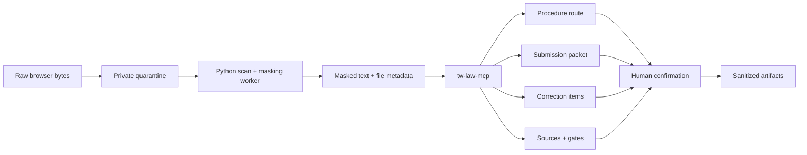

# cc-crossbeam-tw

[](https://github.com/trionnemesis/cc-crossbeam-tw/actions/workflows/secure-web.yml)
[](https://trionnemesis.github.io/cc-crossbeam-tw/)

> **Crossbeam TW** is a source-bound document workflow for Taiwan interior-renovation submissions: route the case, check the packet, decompose corrections, and preserve the evidence needed for human review.

This repository is a prototype for architects, interior-renovation contractors, and administrative coordinators who spend more time reconciling procedures, drawings, correction notices, and missing documents than making the professional decisions themselves.

`tw-law-mcp` turns that work into deterministic, traceable MCP tools. A compatible assistant can inspect the local corpus and source snapshots, return the relevant artifacts and uncertainty, and stop for human confirmation when the evidence is incomplete. It is deliberately not a legal-advice or professional-sign-off system.

[繁體中文說明](./README.zh-TW.md) · [Public Pages](https://trionnemesis.github.io/cc-crossbeam-tw/) · [Architecture](./ARCHITECTURE.md) · [Acceptance evidence](./ACCEPTANCE.md) · [Contributing](./CONTRIBUTING.md)

## Contents

- [Why](#why)
- [How it works](#how-it-works)
- [What it does](#what-it-does)
- [Trust and security](#trust-and-security)
- [Install](#install)
- [Example prompts](#example-prompts)
- [Current status](#current-status)
- [Repository map](#repository-map)
- [Research and design](#research-and-design)
- [FAQ](#faq)

## Why

The difficult part of an interior-renovation submission is rarely a single lookup. The difficult part is keeping these questions connected without losing their provenance:

- Which procedure is this case actually approaching?
- Which documents, drawings, photos, and evidence belong in the submission packet?
- What does each correction item ask someone to change or confirm?
- Which source, date, gate, and professional decision support the next action?

Crossbeam TW is built around that handoff. It keeps domain logic in a standalone MCP server, makes uncertainty visible, and treats human review as a required output rather than an exception.

The current domain focus is New Taipei interior renovation. Other jurisdictions are represented by registry stubs and fail closed until their source corpus and review policy are ready.

## How it works

The repository has two related surfaces:

1. **Standalone MCP server** — the host-neutral `tw-law-mcp` domain boundary used by Codex, Claude Code, or another MCP client.
2. **Secure Web pilot** — a local or single-user browser workflow for case intake, quarantine upload, masking, HITL review, artifacts, audit events, and deletion.



The Secure Web path keeps raw bytes out of the Next.js request body, model prompt, and logs. The local Codex provider is a worker credential only; it is never the website identity provider.

## What it does

| Workflow | Output |
| --- | --- |
| **Procedure routing** | A candidate stage for drawing review, completion inspection, change-of-use plus completion inspection, or simple interior renovation, with confidence and follow-up questions. |
| **Submission checks** | A New Taipei document packet, missing-item list, sheet/file manifest, and source-bound references. |
| **Correction handling** | Masked-document parsing, atomic correction items, response-draft inputs, and a professional confirmation packet. |
| **Professional-domain routing** | Evidence prompts for fire equipment, fire compartments, egress, and material documentation. |
| **Auditability** | Law snapshots, source policy, authority rank, license/update status, as-of dates, gate results, and human-review state. |

The server currently exposes 38 MCP tools across law lookup, source policy, procedure routing, document handling, HITL, scenario checks, and acceptance gates. The canonical tool surface is in [`tw_law_mcp/server.py`](./tw_law_mcp/server.py); the complete scenario index is in [`docs/tw-scenario-feature-matrix.md`](./docs/tw-scenario-feature-matrix.md).

## Trust and security

Read the [Secure Web runbook](./docs/runbook-secure-web.md) before handling real documents.

| Boundary | Rule |
| --- | --- |
| **Input** | Prefer masked text, metadata, and de-identified fixtures. Raw drawings and raw PDFs do not belong in an assistant prompt. |
| **Quarantine** | Browser uploads go directly to private quarantine and must pass scan, validation, and masking before downstream access. |
| **Model** | Only the minimum sanitized fields cross the model boundary. Local Codex execution is read-only, ephemeral, and isolated from the repository. |
| **Domain** | Taiwan procedure and source logic stays in Python `tw_law_mcp`; the web layer does not duplicate legal decisions. |
| **Uncertainty** | Missing evidence, low confidence, professional judgment, and unsupported claims fail closed and produce human-review work. |
| **Production** | Cloud mode rejects local auth, local storage, local DB, in-process jobs, and the local Codex provider until approved adapters and credentials exist. |

This prototype does **not**:

- decide whether a case is legal, illegal, or an unauthorized construction;
- provide legal opinions, compliance guarantees, or professional certification;
- guarantee that an authority will approve a submission;
- decide fire-design conclusions or verify material authenticity;
- enable PDF/image parsing in the authenticated worker; only UTF-8 TXT intake is supported in the pilot.

## Install

### MCP server

Requirements: Python `>=3.10`.

```bash
git clone https://github.com/trionnemesis/cc-crossbeam-tw.git
cd cc-crossbeam-tw

python3 -m unittest discover -s tests
python3 scripts/run_phase_acceptance.py
python3 scripts/tw_law_mcp_stdio.py
```

The repository already includes host configuration:

- Codex App: [`.codex/config.toml`](./.codex/config.toml)
- Claude Code: [`.mcp.json`](./.mcp.json)

### Secure Web pilot

Requirements: Node.js `22.x` and Python `3.14` for the current CI path.

```bash
cd web
npm ci
npm run test:run
npm run typecheck
npm run lint
npm run build
npm start
```

In a second terminal, start the local worker:

```bash
python3 -m worker.secure_worker.server
```

Use [`web/.env.example`](./web/.env.example) and [`docs/runbook-secure-web.md`](./docs/runbook-secure-web.md) for runtime modes, callback configuration, private storage, and external-credential gates. Production deployment is not implied by a green local build.

## Example prompts

The safe pattern is to ask for a workflow artifact and its evidence boundary, not an unqualified legal conclusion.

```text
Please run run_phase_acceptance with tw-law-mcp first.
Using only the masked document text and file metadata I provide, route this case
among drawing review, completion inspection, change-of-use plus completion inspection,
and simple interior renovation.
Return the procedure-stage confidence, human-confirmation questions, corpus packs,
artifacts, and reasons for anything you cannot determine.
Do not provide a legal opinion, compliance guarantee, fire-design conclusion,
material-authenticity conclusion, or approval promise.
```

Other useful requests:

- “Build a New Taipei completion-inspection submission packet and list missing evidence.”
- “Parse this masked correction notice into atomic items and produce a human-confirmation packet.”
- “Show the source IDs, as-of dates, failed gates, and unsupported claims behind this artifact.”

## Current status

This is a **public prototype**, not a production compliance product.

| Area | Current state |
| --- | --- |
| Domain core | `0.4.0`; New Taipei interior renovation is enabled; other jurisdictions fail closed. |
| MCP packaging | Standalone stdio JSON-RPC subset first; Codex and Claude Code remain thin wrappers. |
| Workflow coverage | Groups 1–6 plus Phase 2.1–2.6 / Step 6: source policy, procedure/HITL, data layout, adapters, scenario tools, fixture pipeline, and two-stage flow skeleton. |
| Fixture evidence | 12 synthetic de-identified cases and 84 atomic correction items validate schema, gates, and HITL contract. They do not support real-case claims. |
| Secure Web | Local and single-user pilot paths cover identity, case authorization, direct quarantine upload, masking, Codex-auth worker analysis, HITL, audit, and verified deletion. |
| Still required | Approved real de-identified cases, live official-source ingestion/refresh, public Google/LINE acceptance, and a separately sandboxed PDF/image parser. |

The latest local and CI evidence is recorded in [`ACCEPTANCE.md`](./ACCEPTANCE.md). Missing external credentials are intentionally reported as pending; they are not replaced with synthetic “production accepted” claims.

## Repository map

| Path | Purpose |
| --- | --- |
| [`tw_law_mcp/`](./tw_law_mcp/) | Deterministic law/source repository and MCP server. |
| [`worker/`](./worker/) | Secure upload, masking, domain-processing, and local model-provider boundary. |
| [`web/`](./web/) | Next.js Secure Web pilot and browser-facing workflow. |
| [`scripts/`](./scripts/) | stdio entrypoint, snapshots, and targeted acceptance runners. |
| [`tests/`](./tests/) | Python MCP/domain/worker tests. |
| [`web/tests/`](./web/tests/) | Web, auth, upload, HITL, and security-boundary tests. |
| [`docs/`](./docs/) | Pages site, ADRs, runbook, and feature matrices. |
| [`ACCEPTANCE.md`](./ACCEPTANCE.md) | Current verification evidence and remaining gates. |
| [`TASK-STATE.md`](./TASK-STATE.md) | Secure Web implementation state and external blockers. |

## Research and design

- [`ARCHITECTURE.md`](./ARCHITECTURE.md) — runtime topology, trust boundaries, state machines, and data classes.
- [`docs/ADR-0001-packaging-strategy.md`](./docs/ADR-0001-packaging-strategy.md) — why standalone MCP comes before host-specific plugins.
- [`docs/ADR-0002-secure-web.md`](./docs/ADR-0002-secure-web.md) — single-user Secure Web decisions and production flip conditions.
- [`docs/cc-crossbeam-feature-matrix.md`](./docs/cc-crossbeam-feature-matrix.md) — relationship to the original `cc-crossbeam` workflow.
- [`docs/tw-scenario-feature-matrix.md`](./docs/tw-scenario-feature-matrix.md) — Taiwan scenario coverage and acceptance mapping.
- [`docs/runbook-secure-web.md`](./docs/runbook-secure-web.md) — operational setup, backup, deletion, and incident response.

## FAQ

### Is this a legal-advice tool?

No. It organizes procedures, documents, sources, uncertainty, and questions for professionals. It does not issue legal opinions, compliance guarantees, or sign-off.

### Can I upload a client PDF or drawing?

Not to the current authenticated worker. The pilot accepts UTF-8 TXT and metadata only. Raw files, title blocks, and unmasked personal information require an approved quarantine and parser policy first.

### Why is the MCP server separate from the web app?

The domain and source-of-truth boundary should remain host-neutral. Codex, Claude Code, the Secure Web, and future consumers should call the same deterministic tools instead of copying legal logic into each surface.

### Is the Secure Web production-ready?

No. Local acceptance is documented, while live Google/LINE credentials, public HTTPS acceptance, approved production storage/model adapters, official-source refresh, and real de-identified cases remain explicit gates.

### Where did the workflow idea come from?

The product workflow is informed by [`cc-crossbeam`](https://github.com/trionnemesis/cc-crossbeam)'s document-review and correction-response flow. The Taiwan corpus, jurisdiction rules, source policy, and safety boundaries are implemented independently for this repository.
