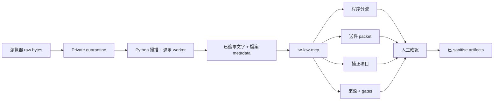

# cc-crossbeam-tw

[](https://github.com/trionnemesis/cc-crossbeam-tw/actions/workflows/secure-web.yml)
[](https://trionnemesis.github.io/cc-crossbeam-tw/)

> **Crossbeam TW** 是一個以來源為邊界的台灣室內裝修送審文件工作流：先做程序分流、檢核送件 packet、拆解補正項目，再保留專業人員進行人工確認所需的證據。

這個 repository 是給建築師、室內裝修業者與代辦／行政窗口使用的原型。它要減少的不是專業判斷，而是程序、圖說、補正公文與缺件文件之間反覆對照、容易遺失依據的工作量。

`tw-law-mcp` 將這些工作拆成 deterministic、可追溯的 MCP tools。支援 MCP 的 AI 助手可以查詢本機 corpus 與來源 snapshot，輸出 artifacts、來源與不確定性；當資料不足或涉及專業裁量時，工具會停下來要求人工確認。它刻意不是法律意見或專業簽證系統。

[English README](./README.md) · [公開 Pages](https://trionnemesis.github.io/cc-crossbeam-tw/) · [架構說明](./ARCHITECTURE.md) · [驗收證據](./ACCEPTANCE.md)

## 目錄

- [為什麼做](#為什麼做)
- [怎麼運作](#怎麼運作)
- [可以做什麼](#可以做什麼)
- [信任與安全](#信任與安全)
- [安裝](#安裝)
- [提問範例](#提問範例)
- [目前狀態](#目前狀態)
- [Repository 結構](#repository-結構)
- [研究與設計](#研究與設計)
- [常見問題](#常見問題)

## 為什麼做

室內裝修送審最難的通常不是查到單一條文，而是同時維持以下問題的連貫性，而且不能丟失來源與責任邊界：

- 這個案件目前比較接近哪一個程序？
- 哪些文件、圖說、照片與證據要放進送件 packet？
- 每一條補正項目實際要求誰修改或確認什麼？
- 下一步行動需要哪個來源、日期、gate 與專業決定支持？

Crossbeam TW 的核心是把這個交接流程整理清楚。domain logic 保留在 standalone MCP server；不確定性會被明確輸出；人工確認是必要產出，不是例外處理。

目前首發場景是新北市室內裝修。其他 jurisdiction 雖已預留 registry stub，但在來源 corpus 與審查政策準備好以前會 fail closed。

## 怎麼運作

這個 repository 有兩個互相關聯的工作面：

1. **Standalone MCP server** — host-neutral 的 `tw-law-mcp` domain boundary，供 Codex、Claude Code 或其他 MCP client 使用。
2. **Secure Web pilot** — 提供本機或 single-user browser workflow，涵蓋案件 intake、quarantine upload、遮罩、HITL review、artifacts、audit events 與刪除。



Secure Web 流程會讓 raw bytes 不進入 Next.js request body、model prompt 或 logs。Local Codex provider 只是 worker 的模型 credential，不是網站的登入身份提供者。

## 可以做什麼

| 工作流 | 產出 |
| --- | --- |
| **程序分流** | 判斷案件比較接近圖說審核、竣工查驗、變更使用併室內裝修竣工查驗或簡易室內裝修，附信心分數與後續確認問題。 |
| **送件檢核** | 新北市送件文件 packet、缺件清單、sheet/file manifest 與 source-bound references。 |
| **補正處理** | 已遮罩文件解析、atomic correction items、回覆草稿輸入與專業確認 packet。 |
| **專業領域 routing** | 消防設備、防火區劃、避難與材料文件的 evidence prompts。 |
| **稽核與溯源** | law snapshots、source policy、authority rank、license/update status、as-of dates、gate results 與人工確認狀態。 |

目前 server 宣告 38 個 MCP tools，涵蓋法規查詢、來源政策、程序分流、文件處理、HITL、scenario checks 與 acceptance gates。canonical tool surface 見 [`tw_law_mcp/server.py`](./tw_law_mcp/server.py)；完整場景索引見 [`docs/tw-scenario-feature-matrix.md`](./docs/tw-scenario-feature-matrix.md)。

## 信任與安全

接觸真實文件前，請先閱讀 [Secure Web runbook](./docs/runbook-secure-web.md)。

| 邊界 | 規則 |
| --- | --- |
| **輸入** | 優先使用已遮罩文字、metadata 與去識別化 fixtures。raw drawing 與 raw PDF 不應直接進入 assistant prompt。 |
| **Quarantine** | 瀏覽器上傳直接進入 private quarantine；必須經過 scan、validation 與 masking 才能供下游使用。 |
| **Model** | 只有最小必要的 sanitized fields 可以跨越 model boundary。Local Codex 執行為 read-only、ephemeral，且與 repository 隔離。 |
| **Domain** | 台灣程序與來源邏輯留在 Python `tw_law_mcp`；web layer 不複製法律判斷。 |
| **不確定性** | 缺證據、低信心、專業判斷與 unsupported claims 都會 fail closed，並產生人工確認工作。 |
| **Production** | 在 approved adapters 與 credentials 存在前，cloud mode 會拒絕 local auth、local storage、local DB、in-process jobs 與 local Codex provider。 |

這個原型**不會**：

- 判定案件合法、違法或違建；
- 出具法律意見、合規保證或專業簽證；
- 保證主管機關一定核准送件；
- 做消防設計結論或驗證材料真偽；
- 在 authenticated worker 中啟用 PDF／圖片解析；pilot 目前只接受 UTF-8 TXT intake。

## 安裝

### MCP server

需求：Python `>=3.10`。

```bash
git clone https://github.com/trionnemesis/cc-crossbeam-tw.git
cd cc-crossbeam-tw

python3 -m unittest discover -s tests
python3 scripts/run_phase_acceptance.py
python3 scripts/tw_law_mcp_stdio.py
```

Repository 已附 host 設定：

- Codex App： [`.codex/config.toml`](./.codex/config.toml)
- Claude Code： [`.mcp.json`](./.mcp.json)

### Secure Web pilot

需求：目前 CI 路徑使用 Node.js `22.x` 與 Python `3.14`。

```bash
cd web
npm ci
npm run test:run
npm run typecheck
npm run lint
npm run build
npm start
```

在第二個 terminal 啟動 local worker：

```bash
python3 -m worker.secure_worker.server
```

Runtime mode、callback 設定、private storage 與 external-credential gates 請參考 [`web/.env.example`](./web/.env.example) 與 [`docs/runbook-secure-web.md`](./docs/runbook-secure-web.md)。Local build 通過不代表已完成 production deployment。

## 提問範例

安全的問法是要求 workflow artifact 與 evidence boundary，而不是要求 AI 直接給出沒有條件的法律結論。

```text
請先使用 tw-law-mcp 執行 run_phase_acceptance。
只根據我提供的已遮罩文件文字與檔案 metadata，判斷案件比較接近：
圖說審核、竣工查驗、變更使用併室內裝修竣工查驗、簡易室內裝修。
請輸出 procedure_stage 信心分數、人工確認問題、corpus packs、產出的 artifacts，
以及目前不能判定的原因。
不要輸出法律意見、合規保證、消防設計結論、材料真偽結論或審查必過承諾。
```

其他適合的請求：

- 「請產生新北市竣工查驗送件 packet，並列出缺少的 evidence。」
- 「請把這份已遮罩補正公文拆成 atomic items，並產生人工確認 packet。」
- 「請列出這個 artifact 背後的 source IDs、as-of dates、failed gates 與 unsupported claims。」

## 目前狀態

這是**公開原型**，不是 production compliance product。

| 範圍 | 目前狀態 |
| --- | --- |
| Domain core | `0.4.0`；新北市室內裝修已啟用；其他 jurisdiction fail closed。 |
| MCP packaging | 先做 standalone stdio JSON-RPC subset；Codex 與 Claude Code 維持 thin wrappers。 |
| Workflow coverage | 已完成 1～6 組與 Phase 2.1～2.6 / Step 6：source policy、procedure/HITL、data layout、adapters、scenario tools、fixture pipeline 與 two-stage flow skeleton。 |
| Fixture evidence | 12 份 synthetic de-identified cases、84 個 atomic correction items，用來驗證 schema、gates 與 HITL contract；不支撐真實案件 claim。 |
| Secure Web | Local 與 single-user pilot 已涵蓋 identity、案件授權、direct quarantine upload、masking、Codex-auth worker analysis、HITL、audit 與 verified deletion。 |
| 仍需完成 | approved real de-identified cases、live official-source ingestion/refresh、公開 Google／LINE acceptance，以及獨立 sandbox 的 PDF／圖片 parser。 |

最新本機與 CI 證據記錄在 [`ACCEPTANCE.md`](./ACCEPTANCE.md)。缺少的 external credentials 會明確標記為 pending，不會用 synthetic 結果冒充 production accepted。

## Repository 結構

| 路徑 | 用途 |
| --- | --- |
| [`tw_law_mcp/`](./tw_law_mcp/) | Deterministic law/source repository 與 MCP server。 |
| [`worker/`](./worker/) | Secure upload、masking、domain processing 與 local model-provider boundary。 |
| [`web/`](./web/) | Next.js Secure Web pilot 與 browser workflow。 |
| [`scripts/`](./scripts/) | stdio entrypoint、snapshots 與 targeted acceptance runners。 |
| [`tests/`](./tests/) | Python MCP/domain/worker tests。 |
| [`web/tests/`](./web/tests/) | Web、auth、upload、HITL 與 security-boundary tests。 |
| [`docs/`](./docs/) | Pages site、ADR、runbook 與 feature matrices。 |
| [`ACCEPTANCE.md`](./ACCEPTANCE.md) | 最新驗收證據與剩餘 gates。 |
| [`TASK-STATE.md`](./TASK-STATE.md) | Secure Web 實作狀態與 external blockers。 |

## 研究與設計

- [`ARCHITECTURE.md`](./ARCHITECTURE.md) — runtime topology、trust boundaries、state machines 與 data classes。
- [`docs/ADR-0001-packaging-strategy.md`](./docs/ADR-0001-packaging-strategy.md) — 為什麼先做 standalone MCP，再做 host-specific plugins。
- [`docs/ADR-0002-secure-web.md`](./docs/ADR-0002-secure-web.md) — single-user Secure Web 決策與 production flip conditions。
- [`docs/cc-crossbeam-feature-matrix.md`](./docs/cc-crossbeam-feature-matrix.md) — 與原始 `cc-crossbeam` workflow 的關係。
- [`docs/tw-scenario-feature-matrix.md`](./docs/tw-scenario-feature-matrix.md) — 台灣 scenario coverage 與 acceptance mapping。
- [`docs/runbook-secure-web.md`](./docs/runbook-secure-web.md) — operational setup、backup、deletion 與 incident response。

## 常見問題

### 這是法律意見工具嗎？

不是。它整理程序、文件、來源、不確定性與待確認問題，供專業人員接手；不出具法律意見、合規保證或簽證。

### 可以上傳客戶 PDF 或圖說嗎？

目前 authenticated worker 不接受這類輸入。Pilot 只接受 UTF-8 TXT 與 metadata。Raw files、title blocks 與未遮罩個資必須等 approved quarantine 與 parser policy 後才能處理。

### 為什麼 MCP server 要和 web app 分開？

Domain 與 source-of-truth boundary 應該保持 host-neutral。Codex、Claude Code、Secure Web 與未來 consumer 都應呼叫同一套 deterministic tools，而不是各自複製法律邏輯。

### Secure Web 已經可以 production 使用嗎？

還不行。本機驗收已有文件證據，但 live Google／LINE credentials、公開 HTTPS acceptance、approved production storage/model adapters、official-source refresh 與 real de-identified cases 仍是明確 gates。

### 這個 workflow 的概念從哪裡來？

產品流程參考 [`cc-crossbeam`](https://github.com/trionnemesis/cc-crossbeam) 的文件審查與補正回覆流程；本 repository 的台灣 corpus、jurisdiction rules、source policy 與安全邊界則獨立實作。
