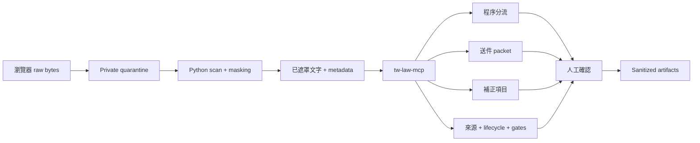
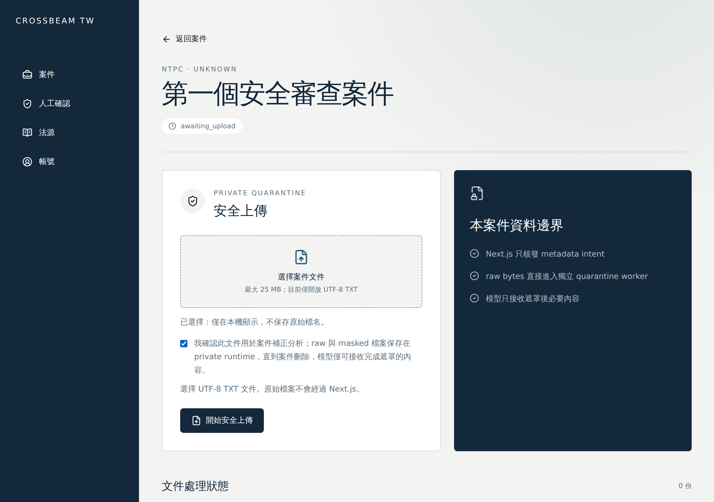
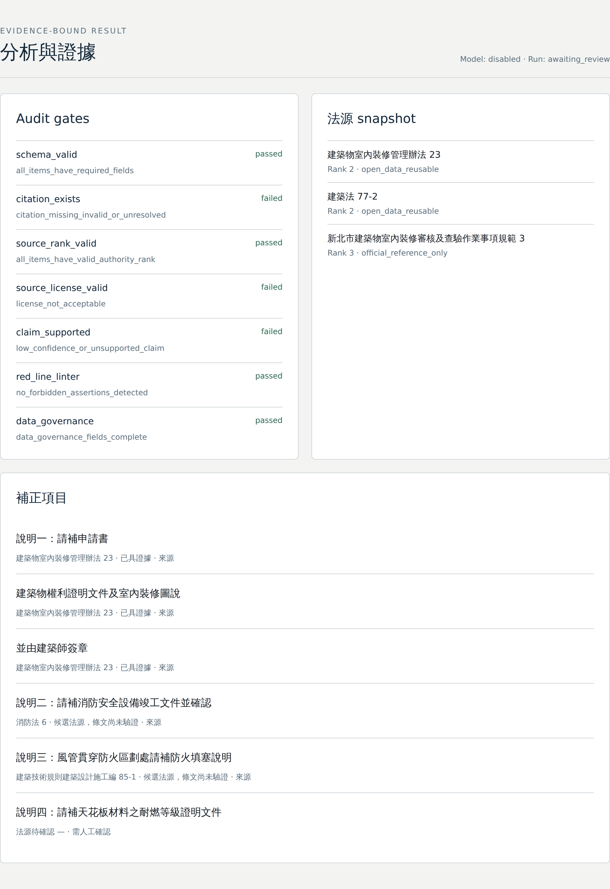
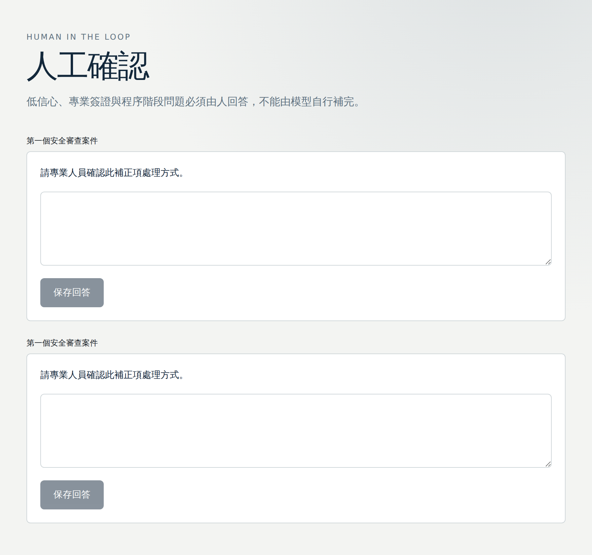
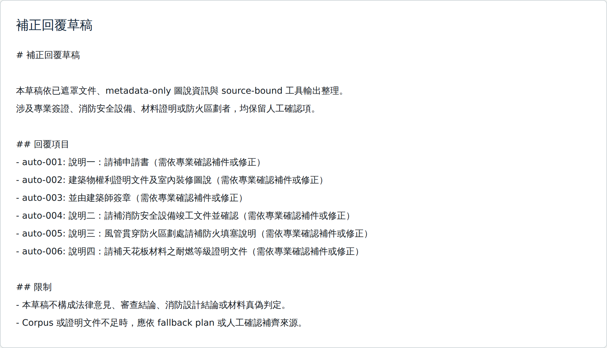

# cc-crossbeam-tw

[](https://github.com/trionnemesis/cc-crossbeam-tw/actions/workflows/secure-web.yml)
[](https://trionnemesis.github.io/cc-crossbeam-tw/)
[](./LICENSE)

> **Crossbeam TW** 是一個以來源為邊界的台灣室內裝修送審文件工作流：先做程序分流、檢核送件 packet、拆解補正項目，再保留專業人員進行人工確認所需的證據。

這個 repository 面向建築師、室內裝修業者與代辦／行政窗口。`tw-law-mcp` 將法規查詢、程序分流、文件檢核、補正拆解與稽核證據整理成 deterministic、可追溯的 MCP tools。資料不足、法規版本不明或涉及專業裁量時，工具會 fail closed 並要求人工確認；它不是法律意見、合規保證或專業簽證系統。

[English README](./README.md) · [公開 Pages](https://trionnemesis.github.io/cc-crossbeam-tw/) · [架構說明](./ARCHITECTURE.md) · [驗收證據](./ACCEPTANCE.md) · [v0.5.0 release notes](./docs/releases/v0.5.0.md)

## 目錄

- [為什麼做](#為什麼做)
- [地方政府法規生命週期](#地方政府法規生命週期)
- [怎麼運作](#怎麼運作)
- [可以做什麼](#可以做什麼)
- [信任與安全](#信任與安全)
- [安裝](#安裝)
- [目前狀態](#目前狀態)
- [Repository 結構](#repository-結構)
- [常見問題](#常見問題)

## 為什麼做

室內裝修送審最難的通常不是查到單一條文，而是同時維持以下問題的連貫性，而且不能遺失來源與責任邊界：

- 案件目前比較接近哪一個程序？
- 哪些文件、圖說、照片與證據要放進送件 packet？
- 每一條補正項目要求誰修改或確認什麼？
- 下一步行動由哪個來源、日期、gate 與專業決定支持？

目前首發場景是新北市室內裝修。臺北市與桃園市維持 registry stub，來源 corpus 與生命週期證據未完成以前不啟用。

## 地方政府法規生命週期

`0.5.0` 開始把「法律事件日期」與「資料處理日期」分開管理，避免把抓取日或人工驗證日誤當成發布、生效或修正日期。

第一個正式套用 lifecycle contract 的地方來源是新北市官方識別碼 `C0170020`。目前可驗證的發布日期為 `2011-04-25`；repository 沒有足夠證據確認 `effective_from` 或修正日期，因此這些欄位保持未知。若使用者指定歷史 `as_of_date`，系統會 fail closed，不會用抓取日期補完法律時點。

地方來源分成兩種證據表示：

- **source snapshot**：只有 exact source snapshot 才能標記為精確條點引註。
- **normalized requirement**：對官方來源進行結構化轉寫，必須保存 jurisdiction、official identifier、point locator、verification time 與 canonical hash，且不得冒充逐字法規快照。

新北市 point 7～11 已拆成 normalized requirements，涵蓋送件文件、簡易申報、消防條件式文件、補正／施工期限與需函送主管機關處理的 escalation conditions。官方詞彙 `簡易申報` 為 canonical term；既有 `簡易室內裝修` 僅保留為 API 相容 alias。

通用 `service.ntpc.gov.tw` 入口目前只標記為 `discovery_reference`。在找到固定 service ID 或特定表單 URL 前，不得拿它當 requirement evidence。

Lifecycle 狀態支援：

- `active`
- `abolished`
- `superseded`
- `pending_reverification`

遇到未知生效日、版本重疊、已廢止來源、pending reverification 或無法唯一選定版本時，一律要求人工確認。

## 怎麼運作

這個 repository 有兩個互相關聯的工作面：

1. **Standalone MCP server** — host-neutral 的 `tw-law-mcp` domain boundary，供 Codex、Claude Code 或其他 MCP client 使用。
2. **Secure Web pilot** — 本機／single-user browser workflow，涵蓋案件 intake、quarantine upload、遮罩、HITL review、artifacts、audit events 與刪除。


```mermaid
flowchart LR
    A[已遮罩文字 + metadata] --> B[tw-law-mcp]
    B --> C[程序分流]
    B --> D[送件 packet]
    B --> E[補正項目]
    B --> F[來源 + lifecycle + gates]
    C --> G[人工確認]
    D --> G
    E --> G
    F --> G

    R[瀏覽器 raw bytes] --> Q[Private quarantine]
    Q --> W[Python scan + masking]
    W --> A
    G --> S[Sanitized artifacts]
```

Secure Web 讓 raw bytes 不進入 Next.js request body、model prompt 或 logs。Local Codex provider 只是 worker 的模型 credential，不是網站登入身份提供者。

### 流程實拍

以下畫面由[合成補正通知](./tests/fixtures/demo_correction_notice.txt)驅動，不含真實案件資料。可用 [`web/scripts/capture-demo.ts`](./web/scripts/capture-demo.ts) 重現；fixture 原始值若出現在畫面，腳本會失敗。









GitHub Pages 是靜態文件站，不是實際部署的 Secure Web instance。

## 可以做什麼

| 工作流 | 產出 |
| --- | --- |
| **程序分流** | 圖說審核、竣工查驗、變更使用併室內裝修竣工查驗或簡易申報候選程序，附信心與待確認問題。 |
| **送件檢核** | 新北市送件文件 packet、缺件清單、sheet/file manifest 與 source-bound references。 |
| **補正處理** | 已遮罩文件解析、atomic correction items、回覆草稿輸入與專業確認 packet。 |
| **專業領域 routing** | 消防設備、防火區劃、避難與材料文件的 evidence prompts。 |
| **地方法規 lifecycle** | active／abolished／superseded／pending_reverification、版本選取與 historical as-of fail-closed。 |
| **稽核與溯源** | law snapshots、source policy、authority rank、license/update status、source locator、hash、gate results 與人工確認狀態。 |

目前 server 宣告 38 個 MCP tools。canonical tool surface 見 [`tw_law_mcp/server.py`](./tw_law_mcp/server.py)；場景索引見 [`docs/tw-scenario-feature-matrix.md`](./docs/tw-scenario-feature-matrix.md)。

## 信任與安全

接觸真實文件前，先閱讀 [Secure Web runbook](./docs/runbook-secure-web.md)。

| 邊界 | 規則 |
| --- | --- |
| **輸入** | 優先使用已遮罩文字、metadata 與去識別 fixtures；raw drawing／PDF 不直接進 assistant prompt。 |
| **Quarantine** | raw upload 必須經 scan、validation、masking 才能供下游使用。 |
| **Model** | 只有最小必要 sanitized fields 可跨越 model boundary。 |
| **Domain** | 台灣程序、來源與 lifecycle 邏輯留在 Python `tw_law_mcp`，web layer 不複製法律判斷。 |
| **不確定性** | 缺證據、未知生效日、pending source change、低信心、專業判斷與 unsupported claim 一律 fail closed。 |
| **Production** | 未具 approved adapters／credentials 前，cloud mode 拒絕 local auth/storage/DB/in-process jobs/local Codex provider。 |

這個原型不會判定案件合法／違法／違建，不會出具法律意見、合規保證、專業簽證或主管機關必然核准的承諾，也不會自行驗證材料真偽或消防設計結論。

## 安裝

### MCP server

需求：Python `>=3.10`。

```bash
git clone https://github.com/trionnemesis/cc-crossbeam-tw.git
cd cc-crossbeam-tw

python3 -m unittest discover -s tests
python3 scripts/run_local_rule_lifecycle_acceptance.py
python3 scripts/run_phase_acceptance.py
python3 scripts/tw_law_mcp_stdio.py
```

Repository 已附 host 設定：

- Codex App： [`.codex/config.toml`](./.codex/config.toml)
- Claude Code： [`.mcp.json`](./.mcp.json)

### Secure Web pilot

目前 CI 路徑使用 Node.js `22.x` 與 Python `3.14`。

```bash
cd web
npm ci
npm run test:run
npm run typecheck
npm run lint
npm run build
npm start
```

第二個 terminal 啟動 local worker：

```bash
python3 -m worker.secure_worker.server
```

## 目前狀態

這是**公開原型**，不是 production compliance product。

| 範圍 | 目前狀態 |
| --- | --- |
| Domain core | `0.5.0`；新北市室內裝修已啟用；其他 jurisdiction fail closed。 |
| Local-rule lifecycle | NTPC `C0170020` active；發布日 `2011-04-25` 已記錄；`effective_from` 未有足夠證據，因此歷史 as-of 查詢 fail closed。Point 7～11 已 normalized + hash check。 |
| MCP packaging | Standalone stdio JSON-RPC subset first；Codex 與 Claude Code 維持 thin wrappers。 |
| Workflow coverage | source policy、procedure/HITL、data layout、adapters、scenario tools、fixture pipeline、two-stage flow 與 local-rule lifecycle acceptance。 |
| Fixture evidence | 12 份 synthetic de-identified cases、84 個 atomic correction items；僅驗證 schema/gates/HITL，不支撐真實案件 claim。 |
| Secure Web | Local/single-user pilot 已涵蓋 identity、案件授權、direct quarantine upload、masking、Codex-auth worker analysis、HITL、audit 與 verified deletion。 |
| 仍需完成 | TPE verified lifecycle pack、TYC verified evidence、官方來源異動監測、#16 三條中央法規 pending snapshots、公開 Google/LINE acceptance、獨立 sandbox PDF/image parser。 |

## Repository 結構

| 路徑 | 用途 |
| --- | --- |
| [`tw_law_mcp/`](./tw_law_mcp/) | Deterministic law/source repository、local-rule lifecycle 與 MCP server。 |
| [`tw_law_mcp/data/local_rules/`](./tw_law_mcp/data/local_rules/) | 地方政府規範 lifecycle records 與 point-level normalized requirements。 |
| [`worker/`](./worker/) | Secure upload、masking、domain processing 與 model-provider boundary。 |
| [`web/`](./web/) | Next.js Secure Web pilot。 |
| [`scripts/`](./scripts/) | stdio entrypoint、snapshots 與 acceptance runners。 |
| [`tests/`](./tests/) | Python domain/worker/lifecycle tests。 |
| [`docs/releases/v0.5.0.md`](./docs/releases/v0.5.0.md) | 本版本 release notes。 |
| [`ACCEPTANCE.md`](./ACCEPTANCE.md) | 驗收證據與剩餘 gates。 |

## 常見問題

### 這是法律意見工具嗎？

不是。它整理程序、文件、來源、不確定性與待確認問題，供專業人員接手；不出具法律意見、合規保證或簽證。

### 為什麼知道某個地方規範目前存在，歷史 `as_of_date` 還是會失敗？

官方來源可以證明目前發布狀態與部分發布資訊，不代表 repository 已掌握完整歷史生效區間。若 `effective_from` 沒有可驗證證據，Crossbeam TW 不會拿抓取日期代替，而是停止自動判定並要求人工確認。

### 可以上傳客戶 PDF 或圖說嗎？

目前 authenticated worker 只接受 UTF-8 TXT 與 metadata。Raw files、title blocks 與未遮罩個資需要 approved quarantine 與 parser policy。

### Secure Web 已 production-ready 嗎？

還沒有。本機驗收已有證據，但 live Google／LINE credentials、公開 HTTPS acceptance、approved production adapters、official-source refresh 與 real de-identified cases 仍是明確 gates。

## 相關專案

- **cc-crossbeam** — 本專案產品設計參考的原始文件審查與補正回覆 workflow，目前此帳號下沒有對應公開 repository。
- [**AIhouskeeperagent**](https://github.com/trionnemesis/AIhouskeeperagent) — 同作者的 AI-assisted operations/housekeeping agent 專案。
